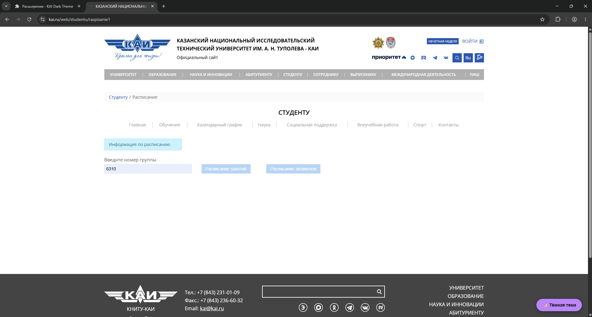
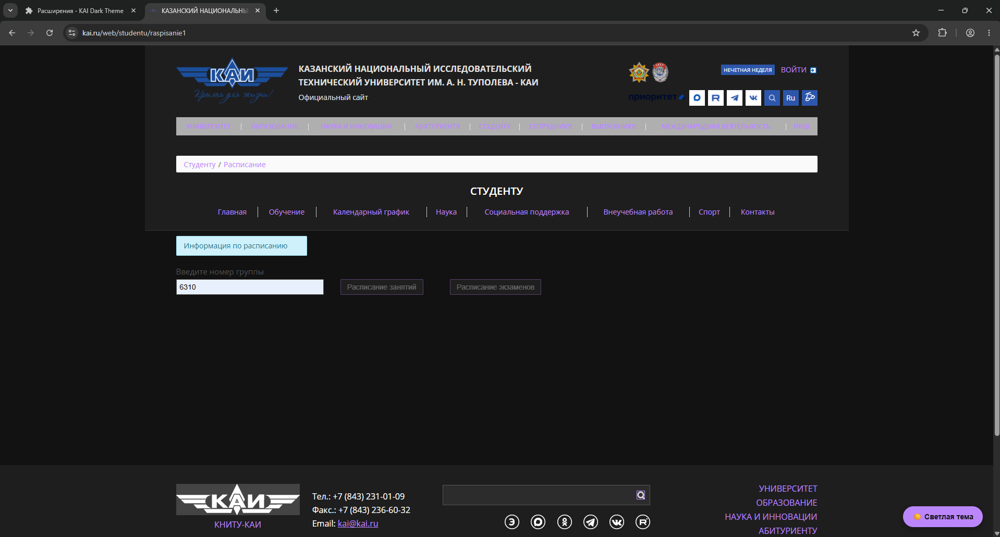

# KAI Dark Theme

Плагин для Google Chrome/Yandex Browser, добавляющий тёмную тему на сайт КНИТУ-КАИ (kai.ru).

## Автор
Студент №10 (Вариант Dark)

## Функциональность
- Добавляет кнопку для переключения тёмной/светлой темы
- Сохраняет выбранную тему в localStorage
- Работает на главной странице и страницах навигации
- Изменяет более 8 стилей (цвета, фоны, границы, отступы)

## Используемые методы
- `getElementById` - для поиска основного контента
- `querySelector` - со сложными селекторами (`.news-list > .news-item`)
- `querySelectorAll` - для всех ссылок
- `parentElement` и `children` - для навигационных меню

## Установка

### Chrome/Yandex Browser
1. Откройте `chrome://extensions/`
2. Включите **"Режим разработчика"**
3. Нажмите **"Загрузить распакованное расширение"**
4. Выберите папку `style-plugin`

## Использование
1. Перейдите на https://kai.ru
2. Нажмите на кнопку **"🌙 Тёмная тема"** в правом нижнем углу
3. Стиль страницы изменится на тёмный
4. При перезагрузке тема сохранится

## Примеры

### Светлая тема (оригинал)

### Тёмная тема

## Бонус
Использованы CSS классы вместо прямого изменения стилей элементов (`.kai-dark-theme`)

## Структура
style-plugin/
├── manifest.json
├── content.js
├── styles.css
├── README.md
└── images/
├── light-theme.png
└── dark-theme.png

## Лицензия
Учебный проект
